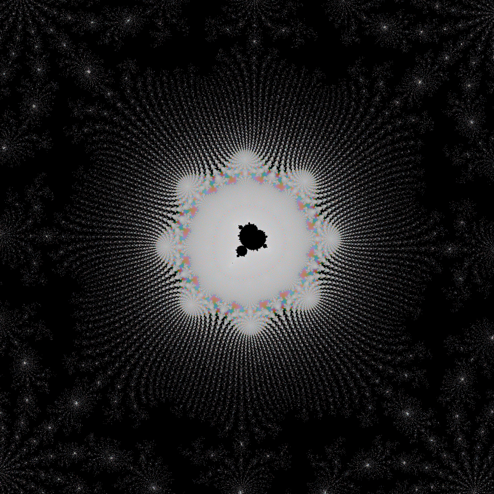

# mandelbrot

For installation instructions see <a href="INSTALL.md">INSTALL.md</a>
 
This project is just an exercise in fractal geometry using the well-known Mandelbrot fractal (see https://en.m.wikipedia.org/wiki/Mandelbrot_set) in combination with a refresh of my Python programming skills. 

To plot the data I use the excellent cplot Python package by Nico Schlömer (https://github.com/nschloe/cplot.git). This package is also available in PyPi. 
I have made some very minor changes to this package and made a fork. You need my fork (https://github.com/alinnman/cplot2.git) to visualize the data quickly since there are some optimizations (using the original cplot will take a very long time). 

The output of the program will always be put in the subdirectory ``pictures`` and this directory will be created if it does not exist already. 

A short note on <b>performance</b>: I wrote this just to refresh my Python programming skills, but stumbled on Cython and took the chance to reach at least acceptable performance levels. On a standard desktop PC with an 8-core Intel i7 processor (running Linux), I have reached a speed of about 2 Megapixels/sec, where the iteration limit for each pixel is 1000. This will probably never match implementations in C, Rust, and other really fast languages. See some samples below. Each picture (1000x1000 pixels) computes in about 0.5 second.  

This command will produce a picture of the (entire) fractal

    python mandelbrot.py -cd picdata/picdata.py -dp 1000 -dpi 400 -cs 4 -sel 0

This will result in a picture like this:     

This command will produce a beautiful rendering of a spiral structure

    python mandelbrot.py -cd picdata/picdata.spiral.py -dp 1000 -dpi 400 -cs 4

This will result in a picture like this:     

This command will produce a structure with irregular branches

    python mandelbrot.py -cd picdata/picdata.branches.py -dp 1000 -dpi 400 -cs 4

This will result in a picture like this:     

This command will produce a structure with a tree structure and a "minibrot" blob

    python mandelbrot.py -cd picdata/picdata.py -dp 1000 -dpi 400 -cs 4 -sel 5

This will result in a picture like this:     

This command will produce a structure with a "seahorse" pattern

    python mandelbrot.py -cd picdata/picdata.py -dp 1000 -dpi 600 -cs 4 -sel 6

This will result in a picture like this:     

Note the little black pattern in the middle which is a "minibrot" and technically part of the Mandelbrot Set. If the Mandelbrot Local Connectivity conjecture (<a href="https://mathoverflow.net/questions/95701/the-deep-significance-of-the-question-of-the-mandelbrot-sets-local-connectednes">MLC</a>) holds then it is connected to the main area through an infinitely thin, extremely long, and complex "black communication line" hidden in the web of "seahorse" patterns. Hard to believe when looking at it. But this conjecture is proven. More about this later. 

This command will produce a structure with a complex "frosty" pattern. It will also be rather demanding to compute this one.

    python mandelbrot.py -cd picdata/picdata.frost.py -dp 2000 -dpi 600 -cs 4  

This will result in a picture like this:     

This picture is an even more enigmatic illustration of the MLC ...

This command will produce a starlike pattern.  

    python mandelbrot.py -cd picdata/picdata.square.py -dp 2000 -dpi 600 -cs 4  

This will result in a picture like this:     

This picture is an even more enigmatic illustration of the MLC ...

